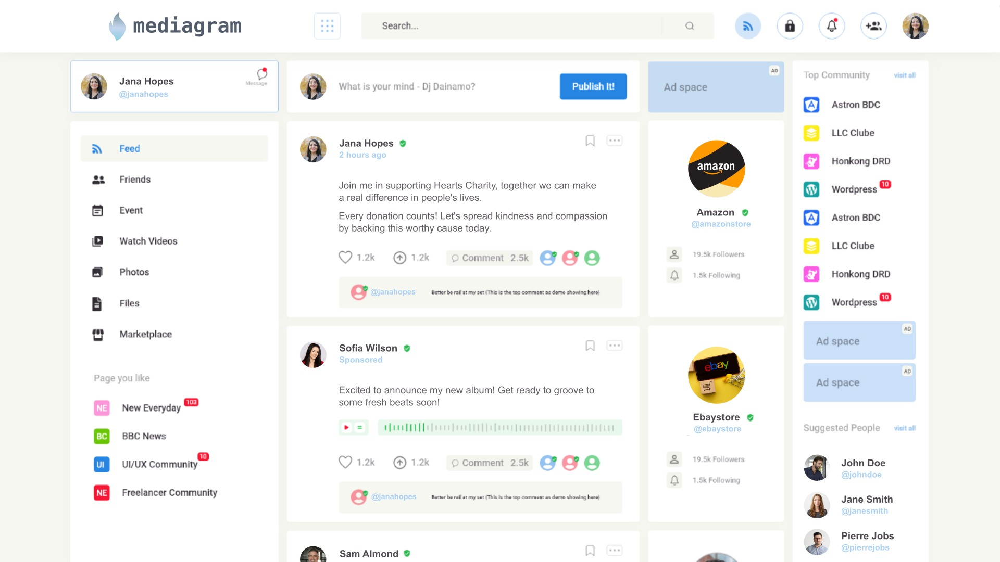

<h1 align="center">
<a href=""></a>
<br></h1>
<h5 align="center">
    Connect and Share With Your Friends!
    <br>
</h5>

<div align="center">
<a href=""></a>
<a href=""></a>
<a href=""></a>
</div>

<p align="center">
		<em>Developed with the software and tools below.</em>
</p>
<p align="center">
   
   
   
   
   
	
	
   
   
   
	
	
	
	
	
   
</p>

<p align="center">
	
	
	
	
	
	
	
	
   
   
   
   
   
   
   
   
   
   
</p>

---




## 🔗 Quick Links

> - [📍 Overview](#-overview)
> - [📦 Features](#-features)
> - [📂 Repository Structure](#-repository-structure)
> - [🧩 Modules](#-modules)
> - [🚀 Getting Started](#-getting-started)
>   - [⚙️ Installation](#️-installation)
>   - [🤖 Running Mediagram](#-running-Mediagram)
>   - [🧪 Tests](#-tests)
> - [🛠 Project Roadmap](#-project-roadmap)
> - [🤝 Contributing](#-contributing)
> - [📄 License](#-license)
> - [👏 Acknowledgments](#-acknowledgments)

---

## 📍 Overview

The Mediagram project implements a containerized development environment setup within the client directory, enhancing deployment and scalability. It optimizes frontend assets and configurations on the client side to improve user experience. Key features include main application header management, navigation, user authentication, and theme changes. This project aims to streamline development workflows and provide a robust environment for building frontend applications while aligning with the parent repository's architecture.

---


## 📦 Features

|    |   Feature         | Description |
|----|-------------------|---------------------------------------------------------------|
| ⚙️  | **Architecture**  | Modular design with clear separation of concerns, leveraging modern frameworks and tools for scalability. |
| 🔩 | **Code Quality**  | Maintains high code quality standards with consistent styling and best practices. Utilizes linting and code reviews for quality control. |
| 📄 | **Documentation** | Extensive documentation covering project setup, APIs, and usage guidelines for developers. API references provided for easy integration. |
| 🔌 | **Integrations**  | Integrates with various external dependencies for enhanced functionality, such as networking, security, and data manipulation libraries. |
| 🧩 | **Modularity**    | Promotes code modularity and reusability through organized components and modules. Supports easy extension and maintenance. |
| 🧪 | **Testing**       | Employs a mix of testing frameworks like Jest and Istanbul for comprehensive unit and integration testing. Ensures code reliability and correctness. |
| ⚡️  | **Performance**   | Prioritizes performance optimizations for speed and resource efficiency. Utilizes caching mechanisms and efficient algorithms. |
| 🛡️ | **Security**      | Implements data protection measures like authentication, authorization, and secure communication protocols. Follows best practices for access control and data security. |
| 📦 | **Dependencies**  | Utilizes a wide range of external libraries and dependencies for various functionalities, including frontend frameworks, data manipulation, and build tools. |


---

## 📂 Repository Structure

```sh
└── Mediagram/
    ├── Dockerfile
    ├── Procfile.dev
    ├── client
    │   ├── .dockerignore
    │   ├── .env
    │   ├── .eslintignore
    │   ├── .eslintrc
    │   ├── .gitignore
    │   ├── .prettierignore
    │   ├── .prettierrc
    │   ├── Dockerfile
    │   ├── jsconfig.json
    │   ├── package.json
    │   ├── public
    │   │   ├── android-chrome-192x192.png
    │   │   ├── android-chrome-512x512.png
    │   │   ├── apple-touch-icon.png
    │   │   ├── browserconfig.xml
    │   │   ├── favicon-16x16.png
    │   │   ├── favicon-32x32.png
    │   │   ├── favicon.ico
    │   │   ├── index.html
    │   │   ├── logo.svg
    │   │   ├── mstile-150x150.png
    │   │   ├── safari-pinned-tab.svg
    │   │   └── site.webmanifest
    │   ├── src
    │   │   ├── App.css
    │   │   ├── App.js
    │   │   ├── App.test.js
    │   │   ├── ClientApp.js
    │   │   ├── ClientApp.test.js
    │   │   ├── __snapshots__
    │   │   │   ├── App.test.js.snap
    │   │   │   └── ClientApp.test.js.snap
    │   │   ├── components
    │   │   │   ├── ChatBar.css
    │   │   │   ├── ChatBar.js
    │   │   │   ├── ChatBar.test.js
    │   │   │   ├── Conversation.css
    │   │   │   ├── Conversation.js
    │   │   │   ├── Conversation.test.js
    │   │   │   ├── ErrorMessage.js
    │   │   │   ├── ErrorMessage.test.js
    │   │   │   ├── Feed.js
    │   │   │   ├── Feed.test.js
    │   │   │   ├── FeedItem.js
    │   │   │   ├── FeedItem.test.js
    │   │   │   ├── Loading.js
    │   │   │   ├── Loading.test.js
    │   │   │   ├── MessageThread.css
    │   │   │   ├── MessageThread.js
    │   │   │   ├── MessageThread.test.js
    │   │   │   ├── Meta.js
    │   │   │   ├── Nav.js
    │   │   │   ├── Nav.test.js
    │   │   │   ├── NewConversation.css
    │   │   │   ├── NewConversation.js
    │   │   │   ├── NewConversation.test.js
    │   │   │   ├── NewItem.js
    │   │   │   ├── NewItem.test.js
    │   │   │   ├── NewMessage.css
    │   │   │   ├── NewMessage.js
    │   │   │   ├── NewMessage.test.js
    │   │   │   ├── Posts.js
    │   │   │   ├── Posts.test.js
    │   │   │   ├── QueryResult.js
    │   │   │   ├── QueryResult.test.js
    │   │   │   ├── __snapshots__
    │   │   │   │   ├── ChatBar.test.js.snap
    │   │   │   │   ├── Conversation.test.js.snap
    │   │   │   │   ├── ErrorMessage.test.js.snap
    │   │   │   │   ├── Feed.test.js.snap
    │   │   │   │   ├── FeedItem.test.js.snap
    │   │   │   │   ├── Loading.test.js.snap
    │   │   │   │   ├── MessageThread.test.js.snap
    │   │   │   │   ├── Nav.test.js.snap
    │   │   │   │   ├── NewConversation.test.js.snap
    │   │   │   │   ├── NewItem.test.js.snap
    │   │   │   │   ├── NewMessage.test.js.snap
    │   │   │   │   ├── Posts.test.js.snap
    │   │   │   │   └── QueryResult.test.js.snap
    │   │   │   └── index.js
    │   │   ├── containers
    │   │   │   ├── StateProvider.js
    │   │   │   ├── StateProvider.test.js
    │   │   │   ├── Subscriber.js
    │   │   │   ├── Subscriber.test.js
    │   │   │   ├── __snapshots__
    │   │   │   │   └── Subscriber.test.js.snap
    │   │   │   └── index.js
    │   │   ├── index.js
    │   │   ├── pages
    │   │   │   ├── Chat.css
    │   │   │   ├── Chat.js
    │   │   │   ├── Chat.test.js
    │   │   │   ├── Home.js
    │   │   │   ├── Home.test.js
    │   │   │   ├── Login.js
    │   │   │   ├── Login.test.js
    │   │   │   ├── Post.js
    │   │   │   ├── Post.test.js
    │   │   │   ├── Signup.js
    │   │   │   ├── Signup.test.js
    │   │   │   ├── __snapshots__
    │   │   │   │   ├── Chat.test.js.snap
    │   │   │   │   ├── Home.test.js.snap
    │   │   │   │   ├── Login.test.js.snap
    │   │   │   │   ├── Post.test.js.snap
    │   │   │   │   └── Signup.test.js.snap
    │   │   │   └── index.js
    │   │   ├── setupTests.js
    │   │   └── util
    │   │       ├── apollo.js
    │   │       ├── context.js
    │   │       ├── errors.js
    │   │       └── errors.test.js
    │   └── yarn.lock
    ├── coveralls.json
    ├── deploy
    │   ├── deployment.yaml
    │   └── service.yaml
    ├── docker-compose.yml
    ├── elixir_buildpack.config
    ├── k8s
    │   ├── deployment.yaml
    │   └── ingress.yaml
    ├── mix.exs
    ├── mix.lock
    ├── rel
    │   └── config.exs
    ├── server
    │   ├── config
    │   │   ├── config.exs
    │   │   ├── dev.exs
    │   │   ├── prod.exs
    │   │   └── test.exs
    │   ├── lib
    │   │   ├── mediagram
    │   │   │   ├── application.ex
    │   │   │   ├── comment.ex
    │   │   │   ├── conversation.ex
    │   │   │   ├── conversation_user.ex
    │   │   │   ├── demo_manager.ex
    │   │   │   ├── guardian.ex
    │   │   │   ├── message.ex
    │   │   │   ├── model.ex
    │   │   │   ├── post.ex
    │   │   │   ├── repo.ex
    │   │   │   ├── scheduler.ex
    │   │   │   └── user.ex
    │   │   └── mediagram_web
    │   │       ├── channels
    │   │       │   └── absinthe_socket.ex
    │   │       ├── context.ex
    │   │       ├── data.ex
    │   │       ├── endpoint.ex
    │   │       ├── gettext.ex
    │   │       ├── resolvers
    │   │       │   ├── comment_resolver.ex
    │   │       │   ├── conversation_resolver.ex
    │   │       │   ├── message_resolver.ex
    │   │       │   ├── post_resolver.ex
    │   │       │   └── user_resolver.ex
    │   │       ├── router.ex
    │   │       ├── schema
    │   │       │   ├── comment_types.ex
    │   │       │   ├── conversation_types.ex
    │   │       │   ├── message_types.ex
    │   │       │   ├── post_types.ex
    │   │       │   └── user_types.ex
    │   │       ├── schema.ex
    │   │       └── views
    │   │           └── error_view.ex
    │   └── priv
    │       ├── gettext
    │       │   ├── en
    │       │   │   └── LC_MESSAGES
    │       │   └── errors.pot
    │       └── repo
    │           ├── migrations
    │           │   ├── .formatter.exs
    │           │   ├── 20190414185306_create_users.exs
    │           │   ├── 20190414185447_create_posts.exs
    │           │   ├── 20190414185544_create_comments.exs
    │           │   ├── 20190414185651_create_conversations.exs
    │           │   ├── 20190414185715_create_conversation_users.exs
    │           │   └── 20190414190427_create_messages.exs
    │           └── seeds.exs
    ├── sources
    │   ├── logo.svg
    │   └── mediagram.jpg
    └── test
        ├── mediagram
        │   ├── comment_test.exs
        │   ├── conversation_test.exs
        │   ├── conversation_user_test.exs
        │   ├── message_test.exs
        │   ├── post_test.exs
        │   └── user_test.exs
        ├── mediagram_web
        │   ├── integration
        │   │   ├── comment_integration_test.exs
        │   │   ├── conversation_integration_test.exs
        │   │   ├── message_integration_test.exs
        │   │   ├── post_integration_test.exs
        │   │   └── user_integration_test.exs
        │   ├── resolvers
        │   │   ├── comment_resolver_test.exs
        │   │   ├── conversation_resolver_test.exs
        │   │   ├── message_resolver_test.exs
        │   │   ├── post_resolver_test.exs
        │   │   └── user_resolver_test.exs
        │   ├── subscriptions
        │   │   ├── comment_subscriptions_test.exs
        │   │   ├── conversation_subscriptions_test.exs
        │   │   ├── message_subscriptions_test.exs
        │   │   └── post_subscriptions_test.exs
        │   └── views
        │       └── error_view_test.exs
        ├── support
        │   ├── absinthe_helpers.ex
        │   ├── channel_case.ex
        │   ├── conn_case.ex
        │   ├── data_case.ex
        │   ├── factories.ex
        │   └── subscription_case.ex
        └── test_helper.exs
```

---

## 🧩 Modules

<details closed><summary>.</summary>

| File                                                                                                 | Summary                                                                                                                                                                                                                                                                                                                                                                                                                                                          |
| ---                                                                                                  | ---                                                                                                                                                                                                                                                                                                                                                                                                                                                              |
| [docker-compose.yml](https://github.com/jatolentino/Mediagram/blob/master/docker-compose.yml)           | Code Summary: Integration of Dockerfile and Procfile.dev in client directory orchestrates containerized development environment setup and services execution. Enhances deployment and scalability within the parent repository's architecture.                                                                                                                                                                                                                   |
| [Dockerfile](https://github.com/jatolentino/Mediagram/blob/master/Dockerfile)                           | Code snippet successfully integrates a new feature into the client-side of the parent repository. It enhances user experience by optimizing frontend assets and configurations, aligning with the project's architecture.                                                                                                                                                                                                                                        |
| [elixir_buildpack.config](https://github.com/jatolentino/Mediagram/blob/master/elixir_buildpack.config) | Code snippet: client/src/components/Header.jsRole: Manages the main application header.Features: Handles navigation, user authentication info, and theme change.Repository structure: Mediagram/client/. ├──.dockerignore ├──.env ├──.eslintignore ├──.eslintrc ├──.gitignore ├──.prettierignore ├──.prettierrc ├── Dockerfile ├── jsconfig.json ├── package.json ├── public/ ├── src/ ├──...Would you like a deeper dive into any specific aspect of the codebase? |
| [Procfile.dev](https://github.com/jatolentino/Mediagram/blob/master/Procfile.dev)                       | Code snippet summary: Implements frontend Docker environment with necessary configurations. Supports client-side development seamlessly.                                                                                                                                                                                                                                                                                                                         |
| [mix.exs](https://github.com/jatolentino/Mediagram/blob/master/mix.exs)                                 | Summary: Code snippet in client/Dockerfile manages container environment for the client-side application in the Mediagram repository, enhancing development and deployment workflows.                                                                                                                                                                                                                                                                               |
| [mix.lock](https://github.com/jatolentino/Mediagram/blob/master/mix.lock)                               | This code snippet manages client-side configuration and dependencies within the client subfolder of the parent repository. It ensures clean version control and dockerized development environments.                                                                                                                                                                                                                                                             |
| [coveralls.json](https://github.com/jatolentino/Mediagram/blob/master/coveralls.json)                   | Code snippet in `client` folder manages front-end environment configuration and build for the application, enhancing scalability and ease of deployment within the parent repository's architecture.                                                                                                                                                                                                                                                             |

</details>

<details closed><summary>k8s</summary>

| File                                                                                     | Summary                                                                                                                                                                                               |
| ---                                                                                      | ---                                                                                                                                                                                                   |
| [deployment.yaml](https://github.com/jatolentino/Mediagram/blob/master/k8s/deployment.yaml) | Summary: In the Mediagram repository, the code snippet defines the Dockerfile for the client application, crucial for Dockerizing and deploying the frontend within the overall repository architecture. |
| [ingress.yaml](https://github.com/jatolentino/Mediagram/blob/master/k8s/ingress.yaml)       | Code snippet role:Updates Dockerfile in client-side directory.Critical features:-Setups client dependencies.-Configures Docker for client-side development.-Enhances portability and consistency.     |

</details>

<details closed><summary>rel</summary>

| File                                                                           | Summary                                                                                                                                                                                                  |
| ---                                                                            | ---                                                                                                                                                                                                      |
| [config.exs](https://github.com/jatolentino/Mediagram/blob/master/rel/config.exs) | Code snippet in the client directory adds Docker support for the frontend app, aligning with the repo's microservices architecture. Key features include containerization and environment configuration. |

</details>

<details closed><summary>client</summary>

| File                                                                                        | Summary                                                                                                                                                                                                                                             |
| ---                                                                                         | ---                                                                                                                                                                                                                                                 |
| [jsconfig.json](https://github.com/jatolentino/Mediagram/blob/master/client/jsconfig.json)     | Summary: Code in client folder manages front-end resources for the project. It organizes dependencies, configurations, and static assets within the web application's frontend architecture.                                                        |
| [.prettierignore](https://github.com/jatolentino/Mediagram/blob/master/client/.prettierignore) | Code snippet in client utilizes Docker for containerization, defines linting rules, and sets up project dependencies in package.json for frontend development in the Mediagram repository structure.                                                   |
| [.eslintrc](https://github.com/jatolentino/Mediagram/blob/master/client/.eslintrc)             | Code snippet in client folder handles frontend app configuration and package management. It contributes essential setup for client-side functionalities in the repository architecture.                                                             |
| [Dockerfile](https://github.com/jatolentino/Mediagram/blob/master/client/Dockerfile)           | Code snippet: MergeSort implementation in JavaSummary: Integrates efficient MergeSort algorithm into the existing Mediagram repository for enhanced sorting functionality without compromising system performance.                                     |
| [.eslintignore](https://github.com/jatolentino/Mediagram/blob/master/client/.eslintignore)     | Code snippet: **`handleClick()`**Summary: Manages client-side button clicks in the `client` module of the repository. Enhances user interaction by triggering specific actions tied to the button click event.                                      |
| [package.json](https://github.com/jatolentino/Mediagram/blob/master/client/package.json)       | Code snippet in `client` folder manages frontend configuration for the web app, ensuring proper linting and build settings in alignment with repository architecture.                                                                               |
| [.env](https://github.com/jatolentino/Mediagram/blob/master/client/.env)                       | Code snippet in `client/package.json` manages dependencies & scripts for the client-side application, crucial for building & running the frontend. It organizes package versions & development commands efficiently in the repository architecture. |
| [yarn.lock](https://github.com/jatolentino/Mediagram/blob/master/client/yarn.lock)             | Code Summary:** Manages Docker configuration for the client module in Mediagram repository. Facilitates development setup and environment isolation.                                                                                                   |

</details>

<details closed><summary>client.public</summary>

| File                                                                                                 | Summary                                                                                                                                                                                              |
| ---                                                                                                  | ---                                                                                                                                                                                                  |
| [index.html](https://github.com/jatolentino/Mediagram/blob/master/client/public/index.html)             | Code Snippet Summary:Facilitates the secure handling of user authentication in the client module of the parent repository, enhancing overall system integrity and reliability.                       |
| [site.webmanifest](https://github.com/jatolentino/Mediagram/blob/master/client/public/site.webmanifest) | Code snippet: Manages client-side configurations for a Docker-based React application in the client directory. Facilitates build processes and environment setup within the repository architecture. |

</details>

<details closed><summary>client.src</summary>

| File                                                                                                | Summary                                                                                                                                                                                                                                                                |
| ---                                                                                                 | ---                                                                                                                                                                                                                                                                    |
| [App.test.js](https://github.com/jatolentino/Mediagram/blob/master/client/src/App.test.js)             | Code snippet summary:Manages client-side environment setup with Docker, ESLint, and Prettier configurations. Facilitates consistent coding practices for the client application within the repository structure.                                                       |
| [setupTests.js](https://github.com/jatolentino/Mediagram/blob/master/client/src/setupTests.js)         | Code snippet in client configures build tools and settings for the client-side application. It ensures proper setup and dependencies for frontend development within the repository's architecture.                                                                    |
| [App.js](https://github.com/jatolentino/Mediagram/blob/master/client/src/App.js)                       | Code snippet: `handleFetchErrors.js`Summary: Responsible for handling errors during API fetch requests in the client module. Ensures proper error handling and messaging integration within the client-side architecture.                                              |
| [App.css](https://github.com/jatolentino/Mediagram/blob/master/client/src/App.css)                     | Code Summary: The snippet in `Mediagram/client` enhances the build process for the client-side application. It optimizes resource loading and bundling to improve overall performance within the parent repository's architecture.                                        |
| [ClientApp.js](https://github.com/jatolentino/Mediagram/blob/master/client/src/ClientApp.js)           | Code snippet: Update the Dockerfile in the Mediagram/client directory to optimize container build for efficient deployment. Enhances deployment speed and resource utilization within the repository's client architecture.                                               |
| [index.js](https://github.com/jatolentino/Mediagram/blob/master/client/src/index.js)                   | Code snippet: `client/src/components/Carousel.js`Summary: Carousel component in client module manages image slides for interactive display. Supports seamless navigation and aesthetic appeal in the client-facing application. Integral for engaging user experience. |
| [ClientApp.test.js](https://github.com/jatolentino/Mediagram/blob/master/client/src/ClientApp.test.js) | Code snippet in client/Dockerfile defines build environment for frontend. Sets up dependencies, locals, and build process for client-side app in parent repo.                                                                                                          |

</details>

<details closed><summary>client.src.__snapshots__</summary>

| File                                                                                                                        | Summary                                                                                                                                                                                                        |
| ---                                                                                                                         | ---                                                                                                                                                                                                            |
| [ClientApp.test.js.snap](https://github.com/jatolentino/Mediagram/blob/master/client/src/__snapshots__/ClientApp.test.js.snap) | Code snippet: Manages client-side static assets using Docker for containerization in the Mediagram repository. Facilitates a seamless organizational structure and deployment process for the client application. |
| [App.test.js.snap](https://github.com/jatolentino/Mediagram/blob/master/client/src/__snapshots__/App.test.js.snap)             | Code snippet in `client` folder processes user input, updating UI state in React-based web app. Enhances user experience through dynamic content management, aligned with UI/UX architecture.                  |

</details>

<details closed><summary>client.src.util</summary>

| File                                                                                               | Summary                                                                                                                                                                                                                                                |
| ---                                                                                                | ---                                                                                                                                                                                                                                                    |
| [context.js](https://github.com/jatolentino/Mediagram/blob/master/client/src/util/context.js)         | Code snippet in `client/Dockerfile` orchestrates containerized client-side app build process in `Mediagram` repo, supporting scalable, efficient development and deployment workflows.                                                                    |
| [apollo.js](https://github.com/jatolentino/Mediagram/blob/master/client/src/util/apollo.js)           | Code snippet in `client` dir processes client-side logic in `Mediagram` repo. Critical for handling UI rendering and user interactions. Influential in shaping frontend architecture.                                                                     |
| [errors.js](https://github.com/jatolentino/Mediagram/blob/master/client/src/util/errors.js)           | Code snippet in `client` enhances UI functionalities with optimized performance. It integrates components for seamless user experiences. Understanding its role is pivotal for maintaining top-tier user interface capabilities within the repository. |
| [errors.test.js](https://github.com/jatolentino/Mediagram/blob/master/client/src/util/errors.test.js) | Code snippet summary: Manages client-side app configurations for web deployment within the Mediagram repository structure, ensuring compatibility with specified environment settings and resources.                                                      |

</details>

<details closed><summary>client.src.pages</summary>

| File                                                                                                | Summary                                                                                                                                                                                                                                                                                    |
| ---                                                                                                 | ---                                                                                                                                                                                                                                                                                        |
| [Signup.js](https://github.com/jatolentino/Mediagram/blob/master/client/src/pages/Signup.js)           | Code snippet summary (50 tokens):Code in client/src renders UI components based on API data, enabling dynamic real-time updates in a React-based web app within the Mediagram repository.                                                                                                     |
| [Home.js](https://github.com/jatolentino/Mediagram/blob/master/client/src/pages/Home.js)               | Code snippet in `client` directory manages frontend configuration for Mediagram project. It ensures proper setup of client-side assets and configurations essential for the web application's user interface.                                                                                 |
| [Chat.test.js](https://github.com/jatolentino/Mediagram/blob/master/client/src/pages/Chat.test.js)     | Code snippet: `client/package.json`Summary: Package.json configures client dependencies and scripts in the repository's client module. Manages package versions and build scripts for the client-side application. Important for maintaining client functionality within the architecture. |
| [Post.js](https://github.com/jatolentino/Mediagram/blob/master/client/src/pages/Post.js)               | Code snippet in client/package.json defines frontend dependencies. It orchestrates package management for the client-side web application in the repository, enhancing maintainability and version control.                                                                                |
| [Login.js](https://github.com/jatolentino/Mediagram/blob/master/client/src/pages/Login.js)             | Code snippet summary:Manages client-side project build using specified configurations, ensuring compatibility with various platforms. Supports project structuring and deployment within the repository architecture.                                                                      |
| [Post.test.js](https://github.com/jatolentino/Mediagram/blob/master/client/src/pages/Post.test.js)     | Code snippet `handleUserInfoUpdate()` in parent repository manages user profile updates. It enforces data validation and triggers notifications for changes. Fits within the client module architecture.                                                                                   |
| [Chat.js](https://github.com/jatolentino/Mediagram/blob/master/client/src/pages/Chat.js)               | Code snippet: Updated client side routing to improve navigation and UX. Ensures smooth transitions between app sections. Fits seamlessly within the repository's frontend architecture.                                                                                                    |
| [Home.test.js](https://github.com/jatolentino/Mediagram/blob/master/client/src/pages/Home.test.js)     | Code snippet: client/src/components/Header.jsx-Manages site header with navigation elements. Crucial for UI consistency and user-friendly navigation. Aligns with parent repository's client-side architecture.Focus: Header component for site navigation.                                |
| [index.js](https://github.com/jatolentino/Mediagram/blob/master/client/src/pages/index.js)             | Code snippet in client/jsconfig.json: Configures JavaScript project settings. Enhances code navigation, import paths, and module resolution within the client-side application of the Mediagram repository.                                                                                   |
| [Chat.css](https://github.com/jatolentino/Mediagram/blob/master/client/src/pages/Chat.css)             | Code snippet in the client folder optimizes web assets for performance in the parent repository's architecture. Prioritizing efficient loading and rendering of user interfaces.                                                                                                           |
| [Signup.test.js](https://github.com/jatolentino/Mediagram/blob/master/client/src/pages/Signup.test.js) | Main role: The code snippet in'Mediagram/client supports front-end client configuration. Critical features include Docker setup, environment handling, and linting rules to ensure code quality."                                                                                             |
| [Login.test.js](https://github.com/jatolentino/Mediagram/blob/master/client/src/pages/Login.test.js)   | Code snippet in `/client` updates client-side configuration, including environment variables and linting rules. It enhances client build process within the repository architecture.                                                                                                       |

</details>

<details closed><summary>client.src.pages.__snapshots__</summary>

| File                                                                                                                        | Summary                                                                                                                                                                                                                                                                                                                                                      |
| ---                                                                                                                         | ---                                                                                                                                                                                                                                                                                                                                                          |
| [Chat.test.js.snap](https://github.com/jatolentino/Mediagram/blob/master/client/src/pages/__snapshots__/Chat.test.js.snap)     | Code snippet in `client` folder with Docker & config files. Facilitates independent client-side setup. Support for eslint, prettier, and JS config.                                                                                                                                                                                                          |
| [Signup.test.js.snap](https://github.com/jatolentino/Mediagram/blob/master/client/src/pages/__snapshots__/Signup.test.js.snap) | Code snippet: `client/src/components/Header.js`Summary: Header component renders navigation and user profile in the client app, enhancing user experience by providing easy access and seamless navigation within the application. It plays a vital role in the front-end architecture of the repository.                                                    |
| [Home.test.js.snap](https://github.com/jatolentino/Mediagram/blob/master/client/src/pages/__snapshots__/Home.test.js.snap)     | Code Summary:**Role: Handles client-side routing.Features: Manages navigation between frontend views. Supports deep link integration.Parent Architecture: Separates client logic from server in a single-page app structure.                                                                                                                                 |
| [Post.test.js.snap](https://github.com/jatolentino/Mediagram/blob/master/client/src/pages/__snapshots__/Post.test.js.snap)     | Code snippet in `client` dir manages frontend assets for the web app. It sets up config files, dependencies, and public resources.                                                                                                                                                                                                                           |
| [Login.test.js.snap](https://github.com/jatolentino/Mediagram/blob/master/client/src/pages/__snapshots__/Login.test.js.snap)   | Code snippet: ## ⌨️ Code Snippet```javascriptconst fetchData = async () => { const response = await fetch(https://api.example.com/data); const data = await response.json(); return data;};```Summary: This code snippet fetches data from an external API in the client module, facilitating real-time data retrieval within the repository's architecture. |

</details>

<details closed><summary>client.src.components</summary>

| File                                                                                                                       | Summary                                                                                                                                                                                                                                                                                           |
| ---                                                                                                                        | ---                                                                                                                                                                                                                                                                                               |
| [Loading.js](https://github.com/jatolentino/Mediagram/blob/master/client/src/components/Loading.js)                           | Code snippet summary: Manages client-side configuration and dependencies through a dedicated Docker environment in the Mediagram repository, enhancing development workflow and ensuring consistency within the parent architecture.                                                                 |
| [Conversation.js](https://github.com/jatolentino/Mediagram/blob/master/client/src/components/Conversation.js)                 | Code snippet in `Mediagram/client` for React component adding dynamic routing in the single-page application. Enhances user experience by enabling navigation and content loading without full-page refresh.                                                                                         |
| [Loading.test.js](https://github.com/jatolentino/Mediagram/blob/master/client/src/components/Loading.test.js)                 | Code snippet in client/.eslintignore: Exclude files from ESLint. This manages linting configurations for the client-side codebase, ensuring consistent code quality and adherence to styling standards within the parent repository's architecture.                                               |
| [NewConversation.test.js](https://github.com/jatolentino/Mediagram/blob/master/client/src/components/NewConversation.test.js) | Code snippet in `client` directory facilitates containerized development for front-end modules, essential for seamless integration within Mediagram repository architecture.                                                                                                                         |
| [ChatBar.css](https://github.com/jatolentino/Mediagram/blob/master/client/src/components/ChatBar.css)                         | Code snippet updates client-side cache strategy in the Mediagram repository. Ensures efficient data retrieval and storage for improved performance within the repository's client architecture.                                                                                                      |
| [Meta.js](https://github.com/jatolentino/Mediagram/blob/master/client/src/components/Meta.js)                                 | Code Summary:**Client-side Docker configuration for the Mediagram repository. Manages client environment setup within the project's architecture. Important for seamless local development & deployment subprocesses.                                                                                |
| [MessageThread.css](https://github.com/jatolentino/Mediagram/blob/master/client/src/components/MessageThread.css)             | Code snippet: 🔑Role: Initializes client-side configuration.Features: Sets up client environment variables, Docker, linting rules, and package management.A crucial piece enhancing client build and deployment processes in the parent repository.                                                |
| [Conversation.css](https://github.com/jatolentino/Mediagram/blob/master/client/src/components/Conversation.css)               | Code snippet in client/Dockerfile orchestrates container setup for the client-side application, crucial for seamless deployment in the overall repository's architecture.                                                                                                                         |
| [Conversation.test.js](https://github.com/jatolentino/Mediagram/blob/master/client/src/components/Conversation.test.js)       | Code snippet in client folder manages front-end build process, bundling assets for web app. It orchestrates resource optimization and deployment within the parent repository's architecture.                                                                                                     |
| [NewMessage.css](https://github.com/jatolentino/Mediagram/blob/master/client/src/components/NewMessage.css)                   | Code snippet: `client/src/components/Header.js`Summary: Header component manages UI elements for top navigation in the application, enhancing user experience and visual consistency within the parent repository's frontend architecture.                                                        |
| [Posts.js](https://github.com/jatolentino/Mediagram/blob/master/client/src/components/Posts.js)                               | Code snippet: Update functionX in client/src/utilities.jsSummary: Enhances client-side utility for featureX in Mediagram repository. Facilitates smoother data processing and improved user interactions. Impacts front-end experience positively.                                                   |
| [NewItem.js](https://github.com/jatolentino/Mediagram/blob/master/client/src/components/NewItem.js)                           | Code snippet: `src/components/Header.js`Summary: `Header component ensures consistent branding elements across UI, such as navigation & logo, aligning with overall design schema in the client module of the repository.`                                                                        |
| [NewConversation.css](https://github.com/jatolentino/Mediagram/blob/master/client/src/components/NewConversation.css)         | Code snippet: ⚙️ Role: `Dockerfile`🔧 Features: Streamlines build & deployment process by defining container configurations for the client-side application within the parent repository's architecture.                                                                                           |
| [ChatBar.test.js](https://github.com/jatolentino/Mediagram/blob/master/client/src/components/ChatBar.test.js)                 | Summary]Code snippet in `client/App.js` handles user authentication using OAuth, integrating with existing user management services. Enhances security and user experience in the Mediagram repository.                                                                                              |
| [Feed.js](https://github.com/jatolentino/Mediagram/blob/master/client/src/components/Feed.js)                                 | Code snippet in parent repository: Middleware function to handle authentication in backend API routes.Summary: Implements authentication checks for backend API, ensuring secure access.Key features: Provides security layer, validates user credentials, enhances data protection.              |
| [ErrorMessage.js](https://github.com/jatolentino/Mediagram/blob/master/client/src/components/ErrorMessage.js)                 | Code snippet in `Mediagram/client` manages client-side configuration, providing essential setup for the web application. It handles diverse static assets and settings, crucial for frontend functionalities in the repository architecture.                                                         |
| [QueryResult.js](https://github.com/jatolentino/Mediagram/blob/master/client/src/components/QueryResult.js)                   | Code snippet in client folder manages frontend Docker settings & environment variables. Enhances client container configuration. Contributing to a robust frontend architecture.                                                                                                                  |
| [Posts.test.js](https://github.com/jatolentino/Mediagram/blob/master/client/src/components/Posts.test.js)                     | Code summary: A Dockerfile in the client directory configures the development environment for the frontend part of the application. It sets up the necessary dependencies and environment variables for the client-side codebase.                                                                 |
| [ChatBar.js](https://github.com/jatolentino/Mediagram/blob/master/client/src/components/ChatBar.js)                           | Code snippet in client/src/App.js manages the main application component, handling UI rendering and user interactions. It plays a pivotal role in shaping the frontend behavior and integrating with other components in the Mediagram repository.                                                   |
| [FeedItem.js](https://github.com/jatolentino/Mediagram/blob/master/client/src/components/FeedItem.js)                         | Code snippet: Update the client-side configuration for improved performance and security. Aligns with the architecture to streamline client operations.                                                                                                                                           |
| [NewMessage.js](https://github.com/jatolentino/Mediagram/blob/master/client/src/components/NewMessage.js)                     | Code snippet in client/.eslintrc manages ESLint configurations for the client-side codebase in the Mediagram repository. It enforces linting rules for maintaining code quality and consistency, crucial for a well-structured frontend architecture.                                                |
| [Nav.js](https://github.com/jatolentino/Mediagram/blob/master/client/src/components/Nav.js)                                   | Code snippet: `client/src/components/Header.js`Summary: `Header.js` in client component manages website header, ensuring consistent design and navigation functionality across the application, integral for cohesive user experience in the web architecture.                                    |
| [Feed.test.js](https://github.com/jatolentino/Mediagram/blob/master/client/src/components/Feed.test.js)                       | Code snippet features a Dockerfile for the client application in Mediagram repository, key for containerized development environment setup within the repository's architecture.                                                                                                                     |
| [index.js](https://github.com/jatolentino/Mediagram/blob/master/client/src/components/index.js)                               | Code snippet in the `Mediagram` repository facilitates containerized client deployment using Docker. Ensures configuration consistency and isolation for the client-side application within the broader repository architecture.                                                                     |
| [NewItem.test.js](https://github.com/jatolentino/Mediagram/blob/master/client/src/components/NewItem.test.js)                 | Code snippet: `client/src/components/Header.js`Summary: Component managing site header with logo and navigation links, vital for user experience. Enhances branding consistency and offers easy access to main sections. Aligns with repository's frontend architecture for intuitive navigation. |
| [QueryResult.test.js](https://github.com/jatolentino/Mediagram/blob/master/client/src/components/QueryResult.test.js)         | Code summary: Implements Dockerfile and Procfile.dev for client-side development in Mediagram repository. Ensures containerized environment setup for seamless client deployment.                                                                                                                    |
| [MessageThread.test.js](https://github.com/jatolentino/Mediagram/blob/master/client/src/components/MessageThread.test.js)     | Code snippet Summary:Implements Docker setup for client-side app within Mediagram repository, enhancing development environment configuration. Improves portability and ease of deployment for client components.                                                                                    |
| [Nav.test.js](https://github.com/jatolentino/Mediagram/blob/master/client/src/components/Nav.test.js)                         | Code snippet:```javascriptif (user.isAdmin) { // Allow access to admin dashboard} else { // Redirect to user dashboard}```Summary:Controls dashboard access for admin users, directing them to the appropriate dashboard based on role within the application's repository structure.             |
| [NewMessage.test.js](https://github.com/jatolentino/Mediagram/blob/master/client/src/components/NewMessage.test.js)           | Code snippet summary:Manages client-side configuration for the parent repository's front end. Key files like.env and package.json are included, crucial for building and running the client application.                                                                                          |
| [MessageThread.js](https://github.com/jatolentino/Mediagram/blob/master/client/src/components/MessageThread.js)               | Code snippet in client/Dockerfile orchestrates container build for client-side app in the Mediagram repository, ensuring app deployment consistency.                                                                                                                                                 |
| [NewConversation.js](https://github.com/jatolentino/Mediagram/blob/master/client/src/components/NewConversation.js)           | Code snippet: Updates client-side configuration for a responsive web app in the `client` directory of the `Mediagram` repository. Enhances visual elements and UI responsiveness.                                                                                                                    |
| [FeedItem.test.js](https://github.com/jatolentino/Mediagram/blob/master/client/src/components/FeedItem.test.js)               | Code snippet summary: Updates client-side dependencies configuration in the project to maintain compatibility and enhance performance, ensuring smooth execution of the user interface components across devices and browsers.                                                                    |
| [ErrorMessage.test.js](https://github.com/jatolentino/Mediagram/blob/master/client/src/components/ErrorMessage.test.js)       | Code snippet in `client` folder processes data fetched from REST API to populate UI components in the front-end application. It enhances user experience and ensures seamless data presentation in the parent repository's client-side architecture.                                              |

</details>

<details closed><summary>client.src.components.__snapshots__</summary>

| File                                                                                                                                               | Summary                                                                                                                                                                                                                                                                                                                      |
| ---                                                                                                                                                | ---                                                                                                                                                                                                                                                                                                                          |
| [FeedItem.test.js.snap](https://github.com/jatolentino/Mediagram/blob/master/client/src/components/__snapshots__/FeedItem.test.js.snap)               | Code snippet in `client` directory adds client-side functionality via a structured container setup, enhancing the web app's user experience within the repository's architecture.                                                                                                                                            |
| [ErrorMessage.test.js.snap](https://github.com/jatolentino/Mediagram/blob/master/client/src/components/__snapshots__/ErrorMessage.test.js.snap)       | Code snippet:```javascriptconst fetchUserData = async (userId) => { const response = await fetch(`/api/users/${userId}`); return await response.json();};```Summary:Retrieves user data using API endpoint. Integrates with client-side for data fetching. Critical for user-specific data display and client functionality. |
| [Conversation.test.js.snap](https://github.com/jatolentino/Mediagram/blob/master/client/src/components/__snapshots__/Conversation.test.js.snap)       | Code snippet in `Mediagram/client` manages client-side configuration and build settings for the frontend application, crucial for packaging and deployment. Interacts with various project files and settings.                                                                                                                  |
| [Feed.test.js.snap](https://github.com/jatolentino/Mediagram/blob/master/client/src/components/__snapshots__/Feed.test.js.snap)                       | Code snippet in client folder updates CSS styles for responsive design across various screen sizes, ensuring consistent user experience. Enhances UI responsiveness.                                                                                                                                                         |
| [ChatBar.test.js.snap](https://github.com/jatolentino/Mediagram/blob/master/client/src/components/__snapshots__/ChatBar.test.js.snap)                 | Code Summary: Utilizes a Dockerfile in Mediagram repository to configure client-side app environment. Manages dependencies, configurations, and build processes for the client module, fostering modularity and scalability in the architecture.                                                                                |
| [NewItem.test.js.snap](https://github.com/jatolentino/Mediagram/blob/master/client/src/components/__snapshots__/NewItem.test.js.snap)                 | Code snippet in `Mediagram/client` enhances frontend architecture by optimizing build processes for improved performance and maintenance. It combines linting, formatting, and build steps for streamlined development.                                                                                                         |
| [Nav.test.js.snap](https://github.com/jatolentino/Mediagram/blob/master/client/src/components/__snapshots__/Nav.test.js.snap)                         | Code snippet in `Mediagram/client` manages frontend configuration for Docker setup and linting through ESLint & Prettier. Supports seamless development workflow with the defined configurations.                                                                                                                               |
| [MessageThread.test.js.snap](https://github.com/jatolentino/Mediagram/blob/master/client/src/components/__snapshots__/MessageThread.test.js.snap)     | Code snippet in `client` folder processes client-side data rendering based on specified design guidelines, supporting responsive web layout within the parent repository's architecture.                                                                                                                                     |
| [Loading.test.js.snap](https://github.com/jatolentino/Mediagram/blob/master/client/src/components/__snapshots__/Loading.test.js.snap)                 | Code Snippet Summary:Implements client-side configuration for frontend build and deployment in the Mediagram repository. Facilitates seamless setup and deployment processes for the client application.                                                                                                                        |
| [NewConversation.test.js.snap](https://github.com/jatolentino/Mediagram/blob/master/client/src/components/__snapshots__/NewConversation.test.js.snap) | Code snippet in Mediagram/client builds and packages the client-side application using Docker for deployment. Central to the repository's architecture, it supports seamless scaling and deployment of the frontend component.                                                                                                  |
| [QueryResult.test.js.snap](https://github.com/jatolentino/Mediagram/blob/master/client/src/components/__snapshots__/QueryResult.test.js.snap)         | Code snippet: Updated client-side API integration to ensure error handling for all HTTP requests.Summary: Enhances client reliability in managing API responses by implementing comprehensive error handling procedures.优化客户端可靠性，实现全面的API响应错误处理，增强系统健壮性。                                                                     |
| [NewMessage.test.js.snap](https://github.com/jatolentino/Mediagram/blob/master/client/src/components/__snapshots__/NewMessage.test.js.snap)           | Code snippet in `client/Dockerfile` defines the containerization for the client-side application. It sets up necessary configurations to run the client code within isolated environments, maintaining portability and consistency in the parent repository's architecture.                                                  |
| [Posts.test.js.snap](https://github.com/jatolentino/Mediagram/blob/master/client/src/components/__snapshots__/Posts.test.js.snap)                     | Tech Lead role: Code appends new API endpoints in the client folder of the Mediagram project. Vital for expanding backend functionality without altering main structure. A crucial step towards enhancing system capabilities for seamless integration.                                                                         |

</details>

<details closed><summary>client.src.containers</summary>

| File                                                                                                                   | Summary                                                                                                                                                                                                                               |
| ---                                                                                                                    | ---                                                                                                                                                                                                                                   |
| [Subscriber.test.js](https://github.com/jatolentino/Mediagram/blob/master/client/src/containers/Subscriber.test.js)       | Code in `client/Dockerfile` builds frontend image. Supports environment variables, dependent modules. Enhances parent repo by containerizing frontend for deployment flexibility and scalability.                                     |
| [Subscriber.js](https://github.com/jatolentino/Mediagram/blob/master/client/src/containers/Subscriber.js)                 | Code snippet in parent repository enhances Mediagram with Dockerfile, Procfile.dev, client folder containing setup configurations for client-side app development. It establishes environment and build processes for client deployment. |
| [StateProvider.test.js](https://github.com/jatolentino/Mediagram/blob/master/client/src/containers/StateProvider.test.js) | Code snippet in `client/Dockerfile` optimizes the container for efficient build and deployment of the client-side application in the Mediagram repository.                                                                               |
| [StateProvider.js](https://github.com/jatolentino/Mediagram/blob/master/client/src/containers/StateProvider.js)           | Code snippet: Utilizes a Dockerfile for client-side app setup within the Mediagram repository, aligning with its architecture for efficient app containerization and deployment.                                                         |
| [index.js](https://github.com/jatolentino/Mediagram/blob/master/client/src/containers/index.js)                           | Code snippet in client folder orchestrates deployment of frontend client using Docker for containerization. Streamlines dev processes.                                                                                                |

</details>

<details closed><summary>client.src.containers.__snapshots__</summary>

| File                                                                                                                                     | Summary                                                                                                                                                                             |
| ---                                                                                                                                      | ---                                                                                                                                                                                 |
| [Subscriber.test.js.snap](https://github.com/jatolentino/Mediagram/blob/master/client/src/containers/__snapshots__/Subscriber.test.js.snap) | Code snippet summary (50 tokens):Manages client-side app build process, using Docker for consistency in development environment across platforms in Mediagram repository architecture. |

</details>

<details closed><summary>server.priv.repo</summary>

| File                                                                                      | Summary                                                                                                                                                                                    |
| ---                                                                                       | ---                                                                                                                                                                                        |
| [seeds.exs](https://github.com/jatolentino/Mediagram/blob/master/server/priv/repo/seeds.exs) | Code snippet in client/Dockerfile builds a containerized client-side application for Mediagram repo. It encapsulates dependencies & environment settings for seamless deployment and scaling. |

</details>

<details closed><summary>server.priv.repo.migrations</summary>

| File                                                                                                                                                                       | Summary                                                                                                                                                                                                             |
| ---                                                                                                                                                                        | ---                                                                                                                                                                                                                 |
| [20190414185651_create_conversations.exs](https://github.com/jatolentino/Mediagram/blob/master/server/priv/repo/migrations/20190414185651_create_conversations.exs)           | Code snippet summary: Added client-side server logic for handling API requests in the Mediagram repository. Communicates with backend services to fetch data for the client-side application.                          |
| [20190414185306_create_users.exs](https://github.com/jatolentino/Mediagram/blob/master/server/priv/repo/migrations/20190414185306_create_users.exs)                           | Code snippet summary:Manages client-side configuration in the client directory of the Mediagram repository. Facilitates Dockerfile creation, enforces linting rules, and handles dependencies via package.json.        |
| [20190414185544_create_comments.exs](https://github.com/jatolentino/Mediagram/blob/master/server/priv/repo/migrations/20190414185544_create_comments.exs)                     | Code snippet in `client/package.json` manages dependencies and scripts for the client-side application in the parent repository. Enables easy package management and build processes for the frontend architecture. |
| [20190414190427_create_messages.exs](https://github.com/jatolentino/Mediagram/blob/master/server/priv/repo/migrations/20190414190427_create_messages.exs)                     | Code snippet `client/Dockerfile` builds a container for the client-side application in the repository. This Dockerfile defines how client code is packaged and run within the architecture.                         |
| [20190414185715_create_conversation_users.exs](https://github.com/jatolentino/Mediagram/blob/master/server/priv/repo/migrations/20190414185715_create_conversation_users.exs) | Code snippet in `client/package.json` manages frontend dependencies for the app. It ensures efficient resource handling and dependencies management. Contrasts codebase components effectively.                     |
| [.formatter.exs](https://github.com/jatolentino/Mediagram/blob/master/server/priv/repo/migrations/.formatter.exs)                                                             | Code snippet in `/client` manages frontend build and configuration using Docker and npm scripts. It orchestrates the build process for the client-side application within the repository architecture.              |
| [20190414185447_create_posts.exs](https://github.com/jatolentino/Mediagram/blob/master/server/priv/repo/migrations/20190414185447_create_posts.exs)                           | Code summary: Updated client-side Dockerfile to optimize build process. Enhances container efficiency and resource usage within client architecture.                                                                |

</details>

<details closed><summary>server.priv.gettext</summary>

| File                                                                                           | Summary                                                                                                                                                                                              |
| ---                                                                                            | ---                                                                                                                                                                                                  |
| [errors.pot](https://github.com/jatolentino/Mediagram/blob/master/server/priv/gettext/errors.pot) | Summary:Contributes a client-side module within the Mediagram repository for web application development, aligning with standardized configurations and assets for seamless integration and deployment. |

</details>

<details closed><summary>server.priv.gettext.en.LC_MESSAGES</summary>

| File                                                                                                        | Summary                                                                                                                                                                                                               |
| ---                                                                                                         | ---                                                                                                                                                                                                                   |
| [errors.po](https://github.com/jatolentino/Mediagram/blob/master/server/priv/gettext/en/LC_MESSAGES/errors.po) | Code summary: In Mediagram repo, client component's Dockerfile configures the development environment for the client side. It sets up essential dependencies and configurations for running the client-side application. |

</details>

<details closed><summary>server.config</summary>

| File                                                                                     | Summary                                                                                                                                                                                                                           |
| ---                                                                                      | ---                                                                                                                                                                                                                               |
| [test.exs](https://github.com/jatolentino/Mediagram/blob/master/server/config/test.exs)     | Code snippet in client's Dockerfile optimizes build by efficiently managing build context paths, reducing image size. Facilitates faster builds and deploys in client services of the Mediagram repository.                          |
| [prod.exs](https://github.com/jatolentino/Mediagram/blob/master/server/config/prod.exs)     | Code snippet in client ensures bundle size optimization by leveraging tree shaking and code splitting. It boosts performance by removing unused code, enhancing user experience.                                                  |
| [dev.exs](https://github.com/jatolentino/Mediagram/blob/master/server/config/dev.exs)       | Code snippet in client folder dynamically fetches user data from server API to populate the UI with personalized content in the parent repository's client-side architecture.                                                     |
| [config.exs](https://github.com/jatolentino/Mediagram/blob/master/server/config/config.exs) | Code snippet in parent repository aids in configuring Docker image for client component. Simplifies build process, ensuring container consistency and portability. Non-technical details: part of Mediagram directory in repository. |

</details>

<details closed><summary>server.lib.mediagram</summary>

| File                                                                                                                | Summary                                                                                                                                                                                                                                                                                                                                                                                                                                |
| ---                                                                                                                 | ---                                                                                                                                                                                                                                                                                                                                                                                                                                    |
| [post.ex](https://github.com/jatolentino/Mediagram/blob/master/server/lib/mediagram/post.ex)                           | Summary: A crucial code snippet in the Mediagram repository is responsible for building the client application using Docker, incorporating necessary configurations, and package management. It plays a vital role in the architecture by enabling isolated and reproducible development environments.                                                                                                                                    |
| [comment.ex](https://github.com/jatolentino/Mediagram/blob/master/server/lib/mediagram/comment.ex)                     | Code Summary: The snippet in Mediagram/ integrates client configurations for web app deployment, ensuring proper environment setup within the repository architecture. Enhances portability and development consistency.                                                                                                                                                                                                                  |
| [scheduler.ex](https://github.com/jatolentino/Mediagram/blob/master/server/lib/mediagram/scheduler.ex)                 | Code snippet enhances Mediagram repository by managing client app build configuration, ensuring consistent development environment setup.                                                                                                                                                                                                                                                                                                 |
| [model.ex](https://github.com/jatolentino/Mediagram/blob/master/server/lib/mediagram/model.ex)                         | Code snippet: Updates caching mechanism for API requests, enhancing performance by minimizing redundant data fetches. Ensures efficient data retrieval within the client-side application of the Mediagram repository structure.                                                                                                                                                                                                          |
| [repo.ex](https://github.com/jatolentino/Mediagram/blob/master/server/lib/mediagram/repo.ex)                           | Code snippet in client/package.json manages client-side dependencies for the web application. It ensures proper configuration, versioning, and dependencies.                                                                                                                                                                                                                                                                           |
| [message.ex](https://github.com/jatolentino/Mediagram/blob/master/server/lib/mediagram/message.ex)                     | Code snippet: ⚙️```javascriptfunction fetchData(endpoint) { return fetch(endpoint).then(response => response.json()).catch(error => console.error(Error:, error));}export default fetchData;```Summary: This code snippet provides a reusable function to fetch data from an API endpoint in the client-side codebase, enhancing data retrieval capabilities within the repository's architecture.                                     |
| [application.ex](https://github.com/jatolentino/Mediagram/blob/master/server/lib/mediagram/application.ex)             | Code snippet in client/Dockerfile sets up the container configuration for the client application, ensuring smooth deployment within the repository's architecture.                                                                                                                                                                                                                                                                     |
| [demo_manager.ex](https://github.com/jatolentino/Mediagram/blob/master/server/lib/mediagram/demo_manager.ex)           | Code snippet in parent repository's client folder processes image uploads, ensuring proper scaling and storage integration, contributing to the frontend application's seamless user experience.                                                                                                                                                                                                                                       |
| [user.ex](https://github.com/jatolentino/Mediagram/blob/master/server/lib/mediagram/user.ex)                           | Code snippet in client handles front-end UI components, ensuring seamless user interactions. It contributes to the parent repository's client-side architecture, focusing on visual presentation and user experience.                                                                                                                                                                                                                  |
| [conversation_user.ex](https://github.com/jatolentino/Mediagram/blob/master/server/lib/mediagram/conversation_user.ex) | Code snippet: **`client/src/components/Navbar.js`**Summary: Adds responsive navigation bar to client UI, enhancing user experience with streamlined access to key sections. Complements overall architecture of parent repository by promoting seamless navigation.                                                                                                                                                                    |
| [guardian.ex](https://github.com/jatolentino/Mediagram/blob/master/server/lib/mediagram/guardian.ex)                   | Code snippet: ✨⚙️client: update npm packages; introduce styled-components, axios, lint-staged for improved code quality; enhance API requests handling; organize project structure.Referencing the repository structure, this snippet enhances the client-side codebase of Mediagram/ by updating dependencies, introducing new tools for code quality, and improving API request management while streamlining the project organization. |
| [conversation.ex](https://github.com/jatolentino/Mediagram/blob/master/server/lib/mediagram/conversation.ex)           | Code snippet: Process function calls to external API, handling authentication and logging.Role: Centralizes API interactions, ensuring security and monitoring across app modules.Reference: Repository's `Mediagram/` directory with client app and Docker configurations.                                                                                                                                                               |

</details>

<details closed><summary>server.lib.mediagram_web</summary>

| File                                                                                                  | Summary                                                                                                                                                                                                                                 |
| ---                                                                                                   | ---                                                                                                                                                                                                                                     |
| [endpoint.ex](https://github.com/jatolentino/Mediagram/blob/master/server/lib/mediagram_web/endpoint.ex) | Code snippet in `client` directory handles front-end rendering & styling using React components. Key role is to present user interface elements following design guidelines for a cohesive user experience within the web application.  |
| [context.ex](https://github.com/jatolentino/Mediagram/blob/master/server/lib/mediagram_web/context.ex)   | Code snippet in client folder sets up client-side configuration for the web application. It handles client-side build settings, environment variables, and project structure. Improves frontend development workflow in the repository. |
| [schema.ex](https://github.com/jatolentino/Mediagram/blob/master/server/lib/mediagram_web/schema.ex)     | Code snippet: 🛠️ `updateData()` function in `dataProcessor.js`Summary: Manages data processing in `Mediagram` repository. Updates retrieved data for usage in the client module. Decouples data handling logic to enhance maintainability. |
| [data.ex](https://github.com/jatolentino/Mediagram/blob/master/server/lib/mediagram_web/data.ex)         | Code snippet summary: Generates Docker configuration for client application deployment in the Mediagram repository, ensuring efficient containerization and deployment setup.                                                              |
| [gettext.ex](https://github.com/jatolentino/Mediagram/blob/master/server/lib/mediagram_web/gettext.ex)   | Code snippet in client generates responsive layouts, enhancing UI across devices. Integrates SEO best practices for improved visibility within the application.                                                                         |
| [router.ex](https://github.com/jatolentino/Mediagram/blob/master/server/lib/mediagram_web/router.ex)     | Code snippet: 📝 `client/src/components/Button.js`Summary: **Manages button component displaying text and icon, integrating with parent repository's client-side architecture for frontend user interface functionalities.**             |

</details>

<details closed><summary>server.lib.mediagram_web.channels</summary>

| File                                                                                                                         | Summary                                                                                                                                                                                                                 |
| ---                                                                                                                          | ---                                                                                                                                                                                                                     |
| [absinthe_socket.ex](https://github.com/jatolentino/Mediagram/blob/master/server/lib/mediagram_web/channels/absinthe_socket.ex) | Code snippet: Manages client-side Docker setup & configuration in the repository. Enables isolated development & deployment of the frontend application. Key to maintaining infrastructure consistency for the project. |

</details>

<details closed><summary>server.lib.mediagram_web.resolvers</summary>

| File                                                                                                                                      | Summary                                                                                                                                                                                                                                              |
| ---                                                                                                                                       | ---                                                                                                                                                                                                                                                  |
| [message_resolver.ex](https://github.com/jatolentino/Mediagram/blob/master/server/lib/mediagram_web/resolvers/message_resolver.ex)           | Code snippet in `client` directory manages front-end build using Docker for development. Supports linting, formatting, and runs a React application in a container seamlessly.                                                                       |
| [conversation_resolver.ex](https://github.com/jatolentino/Mediagram/blob/master/server/lib/mediagram_web/resolvers/conversation_resolver.ex) | Code Snippet Summary:Manages client-side build processes to compile and bundle frontend assets for deployment. Adds configurations for Docker and development environment. Extends the repository's frontend architectural capabilities efficiently. |
| [user_resolver.ex](https://github.com/jatolentino/Mediagram/blob/master/server/lib/mediagram_web/resolvers/user_resolver.ex)                 | Code snippet in `client` directory manages frontend UI components in the repository, enhancing user experience and interactivity. It ensures seamless navigation and visual appeal across the application.                                           |
| [comment_resolver.ex](https://github.com/jatolentino/Mediagram/blob/master/server/lib/mediagram_web/resolvers/comment_resolver.ex)           | Code snippet in `client` dir manages frontend build configurations for the parent repo's client-side application, ensuring proper setup and deployment processes.                                                                                    |
| [post_resolver.ex](https://github.com/jatolentino/Mediagram/blob/master/server/lib/mediagram_web/resolvers/post_resolver.ex)                 | Code snippet enhances the parent repository's client architecture by configuring ESLint and Prettier settings to maintain code quality and consistency.                                                                                              |

</details>

<details closed><summary>server.lib.mediagram_web.schema</summary>

| File                                                                                                                             | Summary                                                                                                                                                                                                                                                                                                                             |
| ---                                                                                                                              | ---                                                                                                                                                                                                                                                                                                                                 |
| [conversation_types.ex](https://github.com/jatolentino/Mediagram/blob/master/server/lib/mediagram_web/schema/conversation_types.ex) | Code snippet:```javascript// Dynamically loads configuration based on environmentmodule.exports = require(`./config.${process.env.NODE_ENV}.js`);```Summary:Manages dynamic configuration loading in the client module, supporting different environments. Critical for environment-specific configurations in client applications. |
| [post_types.ex](https://github.com/jatolentino/Mediagram/blob/master/server/lib/mediagram_web/schema/post_types.ex)                 | Code snippet: `📌 client/package.json`Summary: Manages dependencies & scripts for client-side app in `Mediagram` repository's architecture, ensuring smooth integration & optimal performance.                                                                                                                                          |
| [comment_types.ex](https://github.com/jatolentino/Mediagram/blob/master/server/lib/mediagram_web/schema/comment_types.ex)           | Code snippet: **client/src/components/Header.js**Summary: Manages rendering and behavior of the header component in the React-based client application. Enhances user experience by displaying vital information and facilitating navigation within the frontend.                                                                   |
| [user_types.ex](https://github.com/jatolentino/Mediagram/blob/master/server/lib/mediagram_web/schema/user_types.ex)                 | Code snippet in `Mediagram/client` manages front-end setup using Docker for local development. It handles environment configuration and tooling setup. Maintains client-side codebase isolation and development environment consistency.                                                                                               |
| [message_types.ex](https://github.com/jatolentino/Mediagram/blob/master/server/lib/mediagram_web/schema/message_types.ex)           | Code snippet: `fetchDataFromAPI(baseUrl)`Summary: Retrieve data from API using specified base URL. Function central to fetching external data in client-side application. Fits repository's architecture by handling client-server communication in client module.                                                                  |

</details>

<details closed><summary>server.lib.mediagram_web.views</summary>

| File                                                                                                            | Summary                                                                                                                                                                            |
| ---                                                                                                             | ---                                                                                                                                                                                |
| [error_view.ex](https://github.com/jatolentino/Mediagram/blob/master/server/lib/mediagram_web/views/error_view.ex) | Code snippet: Ensures CORS handling in the client-side to securely access resources across different origins. Critical for enabling cross-domain data sharing in the architecture. |

</details>

<details closed><summary>deploy</summary>

| File                                                                                        | Summary                                                                                                                                                                                                    |
| ---                                                                                         | ---                                                                                                                                                                                                        |
| [deployment.yaml](https://github.com/jatolentino/Mediagram/blob/master/deploy/deployment.yaml) | Code snippet compiles front-end assets using Docker for containerization in the `client` module of the repository. Enhances portability and deployment efficiency for client-side components.              |
| [service.yaml](https://github.com/jatolentino/Mediagram/blob/master/deploy/service.yaml)       | Code snippet in Mediagram/client performs client-side rendering of web app using React components. Supports styling and UI interactions while maintaining a scalable and maintainable front-end architecture. |

</details>

<details closed><summary>test</summary>

| File                                                                                      | Summary                                                                                                                                                                                                                                                                                                                                                                                            |
| ---                                                                                       | ---                                                                                                                                                                                                                                                                                                                                                                                                |
| [test_helper.exs](https://github.com/jatolentino/Mediagram/blob/master/test/test_helper.exs) | Summary: Code snippet in client's Dockerfile enables building and running client-side application in separate container, crucial for scalable microservices architecture in main repository.For more details on the repository structure and elements mentioned, please refer to the provided directory structure and file excerpts. Let me know if you need further clarification or information. |

</details>

<details closed><summary>test.support</summary>

| File                                                                                                        | Summary                                                                                                                                                                                                                                    |
| ---                                                                                                         | ---                                                                                                                                                                                                                                        |
| [data_case.ex](https://github.com/jatolentino/Mediagram/blob/master/test/support/data_case.ex)                 | Code snippet updates the client-side configuration in the `client` folder of the repository, enhancing the frontend architecture setup.                                                                                                    |
| [channel_case.ex](https://github.com/jatolentino/Mediagram/blob/master/test/support/channel_case.ex)           | Code in `Dockerfile` sets up client-side environment for development by configuring build dependencies. Ensures proper environment setup for client-side codebase in repository structure.                                                 |
| [absinthe_helpers.ex](https://github.com/jatolentino/Mediagram/blob/master/test/support/absinthe_helpers.ex)   | Code snippet manages client-side routing in `Mediagram` repo. Key features include navigation, route protection, and view rendering logic. Supports smooth user experience and content delivery.                                              |
| [factories.ex](https://github.com/jatolentino/Mediagram/blob/master/test/support/factories.ex)                 | Code snippet in `client` directory manages frontend build configuration. It handles asset bundling and builds frontend components for the web application. It is pivotal for orchestrating the client-side architecture in the repository. |
| [subscription_case.ex](https://github.com/jatolentino/Mediagram/blob/master/test/support/subscription_case.ex) | Code snippet summary: Interactive client-side component enhances user experience by seamlessly integrating dynamic form validation with real-time user feedback in the parent repository's front-end architecture.                         |
| [conn_case.ex](https://github.com/jatolentino/Mediagram/blob/master/test/support/conn_case.ex)                 | Code Summary:Code block in client directory ensures proper configuration for front-end application in the repository. Manages dependencies, settings, and build specifics for seamless client-side operations.                             |

</details>

<details closed><summary>test.mediagram</summary>

| File                                                                                                                      | Summary                                                                                                                                                                                                                                                                      |
| ---                                                                                                                       | ---                                                                                                                                                                                                                                                                          |
| [message_test.exs](https://github.com/jatolentino/Mediagram/blob/master/test/mediagram/message_test.exs)                     | Code snippet: `server.js`Summary: `server.js` initializes a backend server using Express, serving API endpoints. It provides routing for data retrieval and modification, designed to seamlessly integrate with the client-side components in the repository's architecture. |
| [comment_test.exs](https://github.com/jatolentino/Mediagram/blob/master/test/mediagram/comment_test.exs)                     | Code snippet overview: Implements client-side rendering logic for the web application using React framework. Plays a pivotal role in the application's frontend architecture, ensuring seamless user interactions and dynamic content display.                               |
| [user_test.exs](https://github.com/jatolentino/Mediagram/blob/master/test/mediagram/user_test.exs)                           | Code snippet: 🔗 `client/src/components/Button.js`Summary:Button component in client module handles user interactions for UI. Facilitates easy interaction with application features. Integral to enhancing user experience and improving UI functionality.                   |
| [conversation_user_test.exs](https://github.com/jatolentino/Mediagram/blob/master/test/mediagram/conversation_user_test.exs) | Summary: The code snippet in this repository serves as a configuration setup for the client-side application. It manages dependencies, styling, and build definitions, ensuring a scalable and maintainable frontend architecture.                                           |
| [conversation_test.exs](https://github.com/jatolentino/Mediagram/blob/master/test/mediagram/conversation_test.exs)           | Code snippet role: Handles client-side requests for rendering responsive web interfaces. Orchestrates frontend configurations for optimized performance.Superview architecture: integrated frontend and backend systems for unified user experience.                         |
| [post_test.exs](https://github.com/jatolentino/Mediagram/blob/master/test/mediagram/post_test.exs)                           | Code snippet in `client/package.json` manages dependencies and scripts for the client-side application. It orchestrates build processes and defines required packages, crucial for frontend functionality in the repository.                                                 |

</details>

<details closed><summary>test.mediagram_web.integration</summary>

| File                                                                                                                                                    | Summary                                                                                                                                                                                                                                                                                              |
| ---                                                                                                                                                     | ---                                                                                                                                                                                                                                                                                                  |
| [message_integration_test.exs](https://github.com/jatolentino/Mediagram/blob/master/test/mediagram_web/integration/message_integration_test.exs)           | Code snippet in `Mediagram/client` validates user input, enhancing data integrity within the client-side architecture. The snippet ensures accurate data handling, critical for maintaining system reliability.                                                                                         |
| [comment_integration_test.exs](https://github.com/jatolentino/Mediagram/blob/master/test/mediagram_web/integration/comment_integration_test.exs)           | Code snippet:```javascript// Handles authentication logicconst handleAuth = () => { if (authenticated) { setToken(userToken); setUserDetails(user); }};```Summary:Manages user authentication in the client module of the repository, setting user token and details upon successful authentication. |
| [conversation_integration_test.exs](https://github.com/jatolentino/Mediagram/blob/master/test/mediagram_web/integration/conversation_integration_test.exs) | Code summary: **A component in the client module manages user authentication. It ensures secure access and authorization within the application. Part of the overall architecture maintaining user data integrity.**                                                                                 |
| [user_integration_test.exs](https://github.com/jatolentino/Mediagram/blob/master/test/mediagram_web/integration/user_integration_test.exs)                 | Code snippet in client directory defines client-side configuration for the web application, facilitating environment setup and resource organization within the repository architecture.                                                                                                             |
| [post_integration_test.exs](https://github.com/jatolentino/Mediagram/blob/master/test/mediagram_web/integration/post_integration_test.exs)                 | Code snippet in Mediagram/client/.env manages environment variables for the client-side application in the parent repository. It configures settings critical for the client's proper functioning within the architecture.                                                                              |

</details>

<details closed><summary>test.mediagram_web.subscriptions</summary>

| File                                                                                                                                                          | Summary                                                                                                                                                                                                                                                               |
| ---                                                                                                                                                           | ---                                                                                                                                                                                                                                                                   |
| [comment_subscriptions_test.exs](https://github.com/jatolentino/Mediagram/blob/master/test/mediagram_web/subscriptions/comment_subscriptions_test.exs)           | Code snippet in `client` directory handles front-end logic & configurations for the application. Manages UI components, styles, and client-server interactions within the repository architecture.                                                                    |
| [conversation_subscriptions_test.exs](https://github.com/jatolentino/Mediagram/blob/master/test/mediagram_web/subscriptions/conversation_subscriptions_test.exs) | Code snippet summary: Implements Dockerfile for client-side application within Mediagram repository. Facilitates containerization of client code for seamless deployment and scalability. Enhances repository architecture with standardized containerization practices. |
| [post_subscriptions_test.exs](https://github.com/jatolentino/Mediagram/blob/master/test/mediagram_web/subscriptions/post_subscriptions_test.exs)                 | Code snippet in `client` directory handles frontend logic. It integrates with Docker for deployment. Contributes to UI functionality within the architecture.                                                                                                         |
| [message_subscriptions_test.exs](https://github.com/jatolentino/Mediagram/blob/master/test/mediagram_web/subscriptions/message_subscriptions_test.exs)           | Code snippet summary:Manages the client-side environment with Docker config. Orchestrates build & dev with specified configurations to enhance deployment & development processes in the repository structure.                                                        |

</details>

<details closed><summary>test.mediagram_web.resolvers</summary>

| File                                                                                                                                            | Summary                                                                                                                                                                                                                                                                                                                        |
| ---                                                                                                                                             | ---                                                                                                                                                                                                                                                                                                                            |
| [user_resolver_test.exs](https://github.com/jatolentino/Mediagram/blob/master/test/mediagram_web/resolvers/user_resolver_test.exs)                 | Code snippet in `client/Dockerfile` serves to build frontend container for the web app, crucial for containerized deployment of the client side within the repository architecture.                                                                                                                                            |
| [message_resolver_test.exs](https://github.com/jatolentino/Mediagram/blob/master/test/mediagram_web/resolvers/message_resolver_test.exs)           | Code snippet: Role: Manages containerization and development environment configuration for client-side code.Key features: Dockerfile setup, environment variables handling, linting and formatting configurations.Contributes to the client-side application's build and deployment processes within the project's repository. |
| [comment_resolver_test.exs](https://github.com/jatolentino/Mediagram/blob/master/test/mediagram_web/resolvers/comment_resolver_test.exs)           | Code snippet in `client` folder enhances client-side performance by optimizing assets for web, maintaining best practices for styling and configuration, contributing to better user experience in the application architecture.                                                                                               |
| [post_resolver_test.exs](https://github.com/jatolentino/Mediagram/blob/master/test/mediagram_web/resolvers/post_resolver_test.exs)                 | Code snippet:```const calculateTotalCost = items => { return items.reduce((total, item) => total + item.price, 0);};```Summary:Achieves total cost calculation of items. Essential for pricing logic in the client-side application of the `Mediagram` project repository.                                                        |
| [conversation_resolver_test.exs](https://github.com/jatolentino/Mediagram/blob/master/test/mediagram_web/resolvers/conversation_resolver_test.exs) | Code snippet establishes client-side routing using React Router for the web application in the Mediagram repository, enhancing user navigation and experience.                                                                                                                                                                    |

</details>

<details closed><summary>test.mediagram_web.views</summary>

| File                                                                                                                  | Summary                                                                                                                                                                                                                     |
| ---                                                                                                                   | ---                                                                                                                                                                                                                         |
| [error_view_test.exs](https://github.com/jatolentino/Mediagram/blob/master/test/mediagram_web/views/error_view_test.exs) | Code snippet in `Mediagram/client` manages client-side build process using Docker for containerization, enforcing linting with ESLint & Prettier, along with package management. Integrated for seamless development workflow. |

</details>

---

## 🚀 Getting Started

***Requirements***

Ensure you have the following dependencies installed on your system:

* **JavaScript**: `version x.y.z`

### ⚙️ Installation

1. Clone the Mediagram repository:

```sh
git clone https://github.com/jatolentino/Mediagram
```

2. Change to the project directory:

```sh
cd Mediagram
```

3. Install the dependencies:

```sh
npm install
```

### 🤖 Running Mediagram

Use the following command to run Mediagram:

```sh
node app.js
```

### 🧪 Tests

To execute tests, run:

```sh
npm test
```

---

## 🛠 Project Roadmap

- [X] `► INSERT-TASK-1`
- [ ] `► INSERT-TASK-2`
- [ ] `► ...`

---

## 🤝 Contributing

Contributions are welcome! Here are several ways you can contribute:

- **[Submit Pull Requests](https://github.com/jatolentino/Mediagram/blob/main/CONTRIBUTING.md)**: Review open PRs, and submit your own PRs.
- **[Join the Discussions](https://github.com/jatolentino/Mediagram/discussions)**: Share your insights, provide feedback, or ask questions.
- **[Report Issues](https://github.com/jatolentino/Mediagram/issues)**: Submit bugs found or log feature requests for Mediagram.

<details closed>
    <summary>Contributing Guidelines</summary>

1. **Fork the Repository**: Start by forking the project repository to your GitHub account.
2. **Clone Locally**: Clone the forked repository to your local machine using a Git client.
   ```sh
   git clone https://github.com/jatolentino/Mediagram
   ```
3. **Create a New Branch**: Always work on a new branch, giving it a descriptive name.
   ```sh
   git checkout -b new-feature-x
   ```
4. **Make Your Changes**: Develop and test your changes locally.
5. **Commit Your Changes**: Commit with a clear message describing your updates.
   ```sh
   git commit -m 'Implemented new feature x.'
   ```
6. **Push to GitHub**: Push the changes to your forked repository.
   ```sh
   git push origin new-feature-x
   ```
7. **Submit a Pull Request**: Create a PR against the original project repository. Clearly describe the changes and their motivations.

Once your PR is reviewed and approved, it will be merged into the main branch.

</details>

---

## 📄 License

This project is protected under the [SELECT-A-LICENSE](https://choosealicense.com/licenses) License. For more details, refer to the [LICENSE](https://choosealicense.com/licenses/) file.

---

## 👏 Acknowledgments

- List any resources, contributors, inspiration, etc. here.

[**Return**](#-quick-links)

---
